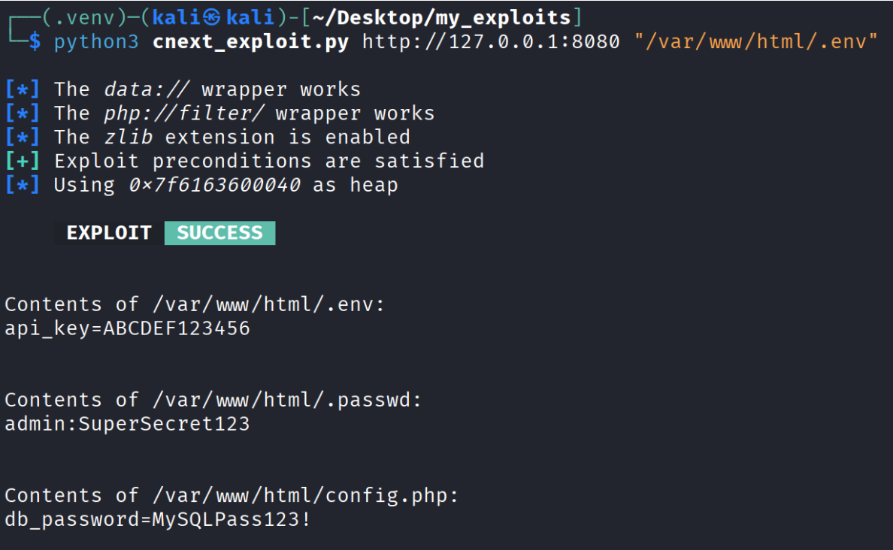
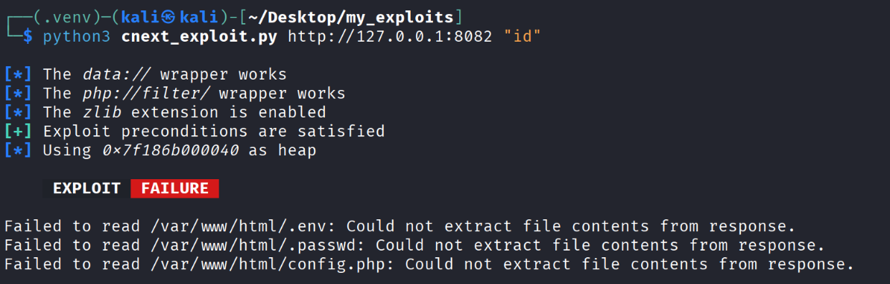
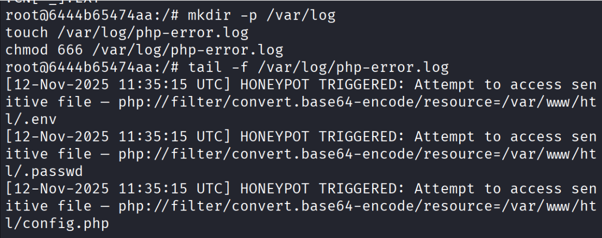

# 💻 The Ultimate Guide to CVE-2024-2961  
### *A CNEXT Buffer Overflow Vulnerability Walkthrough*

This project provides a full, reproducible lab environment for understanding, detecting, and safely exploiting CVE-2024-2961.  
You’ll build the vulnerable setup using Docker and Kali Linux, analyse the behaviour, capture controlled exploitation evidence, and implement layered mitigations.

The guide includes:
- A hardened PHP harness  
- Custom honeypot files and endpoints  
- Patch scripts for disabling dangerous iconv encodings  
- Step-by-step environment setup and verification  

Perfect for learning both **offensive** and **defensive** sides of this vulnerability.


## ✍️ Foreword From The Author

This CVE was chosen as the project topic for my Cyber Security Unit **ICT279** at Murdoch University.  
I am sharing the details of this project here so that other students and learners can benefit from it and safely reproduce the work in a controlled virtual lab environment.

Initially, when I did some research on this CVE, most of the available resources were filled with highly technical jargon. While informative, they were often difficult to understand for someone just starting out and follow through. My goal in documenting this project is to provide a clear, step‑by‑step explanation of the exploitation, detection, and mitigation process. 
I hope this guide will be useful to students and enthusiasts who are finding their way in the ethical hacking and vulnerability research space.

This project was a collaborative effort, and I would like to acknowledge my teammates whose contributions were invaluable:
1. **Syeda Noor Zainab**  
2. **Eeman Faizan**

Good luck in this endeavour , and I hope this project inspires you to explore cybersecurity with curiosity and responsibility.

— *Fatima Faisal*


## Setting up the vulnerable environment
A Kali virtual machine can be downloaded from the official website and loaded into the Oracle virtual box (link also provided in the reference list)If you have not done this step then I recommend watching a youtube video on how to set that up properly. <br>

This guide assumes you already have a Kali machine up and running. Most of the commands below will be pasted into the kali terminal so do not get confused about that.

### 1.Install Docker 
In your Kali terminal, paste this code to download Docker:

```bash
sudo apt update
sudo apt install -y ca-certificates curl gnupg lsb-release

sudo mkdir -p /etc/apt/keyrings
curl -fsSL https://download.docker.com/linux/ubuntu/gpg | sudo gpg --dearmor -o /etc/apt/keyrings/docker.gpg

echo \
"deb [arch=$(dpkg --print-architecture) signed-by=/etc/apt/keyrings/docker.gpg] \
https://download.docker.com/linux/ubuntu $(lsb_release -cs) stable" | \
sudo tee /etc/apt/sources.list.d/docker.list > /dev/null

sudo apt update
sudo apt install -y docker.io
sudo apt install -y docker-ce docker-ce-cli containerd.io docker-compose-plugin
```


### 2.Allow Docker without sudo:
```bash
sudo groupadd docker
sudo usermod -aG docker $USER
newgrp docker
```
### 3.Create Project Folder
```bash
mkdir -p ~/cve2961_lab
cd ~/cve2961_lab
```

### 4.Project Files
The following files are already provided in this repository:
Dockerfile — vulnerable base environment
index.php — vulnerable PHP endpoint
nginx.conf — nginx server configuration
start.sh — service entrypoint script
All file contents are given in the code files above in this repository.

Verify Files using:
```bash
ls -l
```

You should be able to see this:
Dockerfile
index.php
nginx.conf
start.sh

### 5. Build the Docker Image
```bash
docker build -t cve2961_target:lab --progress=plain
```

Confirm image exists:
```bash
docker inspect cve2961_target:lab
```

### 6. Run the Vulnerable Container
```bash
docker run -d -p 8080:80 --name cve2961_container cve2961_target:lab
```
Restart the container if needed:
```bash
sudo docker start cve2961_container
```

### 7. You can enter the root of the Docker Ubuntu Environment using this command:
```bash
sudo docker exec -it cve2961_container bash
```

### 8. Verify Web Service
```bash
curl -i http://127.0.0.1:8080/
```

## 🚨 The Exploitation Step
Below are the complete steps for setting up, preparing, and running the exploit.
Follow them in order.

### 1. Get the Exploit Code from Ambionics
Run these commands inside your Kali terminal in the my_exploits folder:
```Bash
sudo apt-get update
sudo apt-get -s install git python3 python3-pip

git clone https://github.com/ambionics/cnext-exploits.git my_exploits
```

IMPORTANT STEP - First open the github exploit using the command below:
```bash
sudo nano cnext_exploit.py
```
Then, this repo contains a file called "exploitcodechanges.py", open it and follow the instructions there. The first chunk of code should replace the remote class in the main exploit file, and the second chuck of code needs to be pasted at the very end of the main exploit file. <br>
Save this exploit file and exit.


### 2. Also make sure you have a python3 environment
```Bash
cd ~/Desktop/my_exploits

if [ -f requirements.txt ]; then pip3 install -r requirements.txt; fi

python3 -m venv .venv
source .venv/bin/activate
pip install --upgrade pip
pip install -r requirements.txt
```

### 3. Add the fake passwords 
Enter the Docker Container:
```bash
sudo docker exec -it cve2961_container bash
```
Add a .passwd file:
```bash
echo "admin:SuperSecret123" > /var/www/html/.passwd
chmod 644 /var/www/html/.passwd
chown www-data:www-data /var/www/html/.passwd
```

Create env.:
```bash
echo "API_KEY=supersecretapikey123" > /var/www/html/.env
```

Create config.php:
```bash
cat <<EOF > /var/www/html/config.php
<?php
\$db_user = 'root';
\$db_pass = 'MySQLPass123!';
?>
EOF
```

Fix permissions:
```bash
chmod 644 /var/www/html/.env /var/www/html/.passwd /var/www/html/config.php
```

## 5. Run the Exploit Code
Open a second Kali terminal, then:
```bash
cd my_exploit
```

Start the python3 environment:
```bash
python3 -m venv .venv
source .venv/bin/activate
```

Run the exploit:
```bash
python3 cnext_exploit.py http://127.0.0.1:8080 "/var/www/html/.env"
```

This is what you should see, and if you do then congratulations!! You have successfully exploited CVE 2024 2961!




## 🔍 Detection 

Now this is just the beginning, we still have the detection and mitigation to do so lets take a look at how to detect that the victim's system has been compromised. <br>
Based on the research I did, there are two ways to hint at the fact that someone caused a buffer overflow on you website by using the extended chinese character set. 

### The First Method - Check for the enabled CNEXT chatacter set 

### Step 1: 
The first step is to check whether the CNEXT character set is enabled. In our case we will check this in the root of our Ubuntu container so start it and enter it using:

```bash
sudo docker start cve2961_container
sudo docker exec -it cve2961_container bash   # write the correct name of your exploiting container
```
### Step 2: check for chinese encoding - type this inside docker terminal:
```bash
iconv -l | grep -E 'CN-?EXT'
```

If output is this then the container is vulnerable:
ISO-2022-CN-EXT

### The Second Method - Check the php logs
### Step 1: Inside the container, check the PHP-FPM logs
```bash
tail -n 50 /var/log/php8.1-fpm.log
```

### Step 2: Look for this log entry
[07-Nov-2025 12:25:39] WARNING: [pool www] child 15 exited on signal 9 (SIGKILL) after 586.031004 seconds from start

If you see "SIGKILL" then it means the server was ungracefully killed. Normally, SIGTERM is used but here we can notice something is off which means there was a buffer overflow attack.


## 🛡️ Mitigation (Honeypot + Hardening Setup)

Here we will diable the bad character CNEXT encodings, create a honeypot, and harden the sensitive files.

### **Step 1: Create the PHP file**
Inside the container, edit the index.php file and add the code that I provided in this repo labbeled "mitigation_index.php":

```bash
nano /var/www/html/index.php
```

### Step 2: Save and exit, then restart container (on your Kali)
```bash
docker restart cve2961_container
```

### Step 3: Now we will create the honeypot, so enter the container again
```bash
sudo docker exec -it cve2961_container bash
```

### Step 4: Create the honeypot files
```bash
cd /var/www/html
echo "API_KEY=FAKE-1234567890" > .env
echo "admin:FakePassword123" > .passwd
echo "<?php \$db_user = 'root'; \$db_pass = 'FakePass123'; ?>" > config.php
```

### Step 5: Create honeypot endpoints
```bash
echo "<?php http_response_code(403); error_log('HONEYPOT TRIGGERED: /admin.php accessed'); ?>" > admin.php
echo "<?php http_response_code(403); error_log('HONEYPOT TRIGGERED: /backup.sql accessed'); ?>" > backup.sql
```

### Step 6: Create hardening script - fix2961.sh
Paste this command inside the root and paste the contents of fix2961.sh I provided in the repo:
```bash
nano /root/fix2961.sh
```

### Step 7: Make script executable & run
```bash
chmod +x /root/fix2961.sh
bash /root/fix2961.sh
```

### Step 8: Restart container (on the Kali terminal)
```bash
docker restart cve2961_container
```

### Step 9: Confirm the vulnerable encodings are disabled
```bash
iconv -l | grep -Ei 'CN[-_]?EXT|ISO[-_]?2022[-_]?CN[-_]?EXT'
```
There should be NO output here which means we successfully disabled the CNEXT encodings.

### Step 10: Create log directory (this will help us monitor what actions the attacker has done)
```bash
mkdir -p /var/log
touch /var/log/php-error.log
chmod 666 /var/log/php-error.log
```

### Step 11: Restart Apache + PHP-FPM
```bash
service php8.1-fpm restart
service apache2 restart
```

### Step 12: Run exploit on your Kali terminal
Here we should see an Exploit Failure message and fail to read the files which means our mitigation was successfull!!
```bash
python3 cnext_exploit.py http://127.0.0.1:8080 "/var/www/html/.env"
```


### Step 13: Watch the honeypot log
```bash
tail -f /var/log/php-error.log
```
The honeypot will show you messages that there was an attempt to access sensitive files, which means our honeypot is working perfectly:



## 👩‍💻✨ You Made It till the End!!
Thank you for reading this far and I hope this information was useful to you <3

## 📚 References

1. **Ambionics Security – Full Python Exploit Code**  
   👉 [cnext-exploit.py](https://github.com/ambionics/cnext-exploits/blob/main/cnext-exploit.py)

2. **Knownsec 404 Team – Vulnerability Analysis & Docker Reproduction Guide**  
   👉 [Analysis of CVE-2024-2961](https://medium.com/@knownsec404team/analysis-of-cve-2024-2961-vulnerability-e81c165cd897)

3. **GLM Dev – Mitigation Strategies for CVE-2024-2961**  
   👉 [Mitigating the iconv Vulnerability](https://glmdev.medium.com/mitigating-the-iconv-vulnerability-for-php-cve-2024-2961-8537acd2ce8c)

4. **Kali – Official Kali Linux Platform Downloads** <br>
   👉 [Download Kali Linux](https://www.kali.org/get-kali/#kali-platforms)


